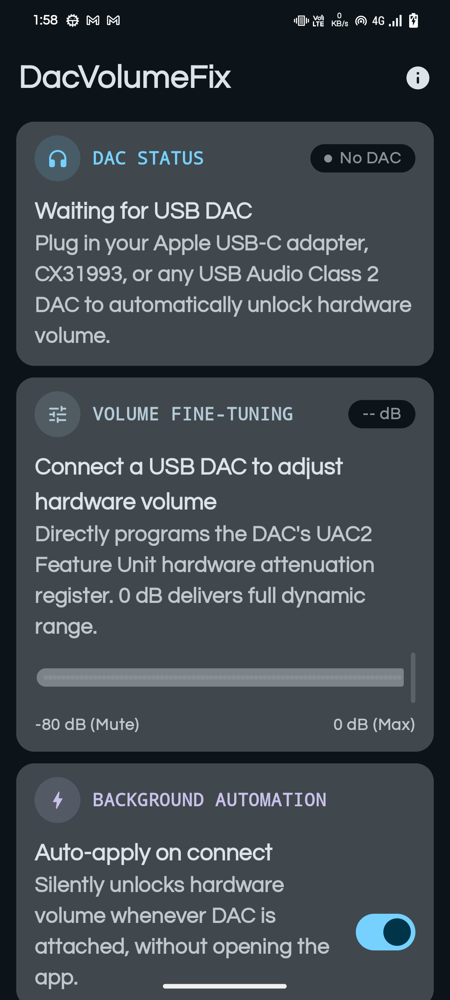
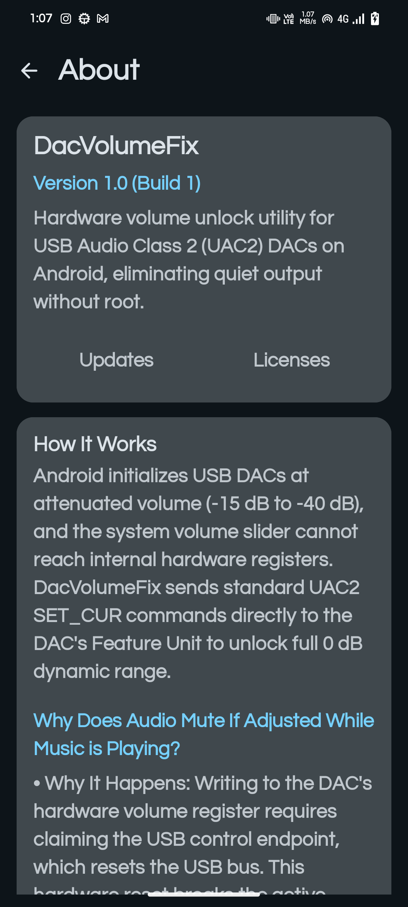

# DacVolumeFix

[-green.svg)](https://developer.android.com)

> **Automatically unlocks full hardware volume on USB DACs connected to Android — no root, no setup, 2.4 MB.**

  
  &nbsp;&nbsp;&nbsp;&nbsp;
  

---

## The Problem

Most modern Android smartphones have dropped the 3.5mm headphone jack, requiring you to use a USB-C to 3.5mm headphone adapter or DAC. However, when you connect popular DACs like the **Apple USB-C Headphone Adapter**, your music often sounds shockingly quiet and powerless—even with your Android volume slider maxed out at 100%.

This happens because the DAC initializes its internal hardware volume chip to an aggressive low default (usually around -20 dB to -40 dB, or roughly 15% to 25% of potential output). While Windows, macOS, and iOS automatically send a command to set the DAC's hardware volume to full (0 dB unity gain), **Android completely ignores this hardware register**. The Android volume slider only scales the digital audio before sending it out, leaving the physical amplifier permanently starved of power.

**DacVolumeFix solves this automatically.** Whenever your DAC is plugged in, DacVolumeFix quietly sends the standard USB Audio Class command to unlock the hardware volume register to full 0 dB output—giving you the rich dynamic range, volume, and driving power your headphones were meant to have.

---

## Supported DACs

| DAC / Headphone Adapter | Chipset / Model | Status | Output Level |
|---|---|---|---|
| **Apple USB-C Adapter (US)** | Model A2049 (VID: `0x05AC`, PID: `0x110A`) | **Confirmed Working** | 1.0 Vrms (Full Output) |
| **Apple USB-C Adapter (EU)** | Model A2155 (VID: `0x05AC`, PID: `0x110B`) | **Confirmed Working** | 0.5 Vrms (Full Output) |
| **Conexant / Synaptics** | CX31993 (JCALLY JA04, Abigail, etc.) | *Expected Compatible* | Needs Community Test |
| **Realtek** | ALC5686 / ALC4042 / ALC4050 | *Expected Compatible* | Needs Community Test |
| **Cirrus Logic** | CS43131 / CS43198 (Moondrop, Tanchjim) | *Expected Compatible* | Needs Community Test |
| **FiiO** | KA11, KA13, JA11 | *Expected Compatible* | Needs Community Test |
| **ESS Sabre** | ES9280AC / ES9281AC / ES9038Q2M | *Expected Compatible* | Needs Community Test |
| **Generic USB Audio Class 1/2** | Any compliant UAC1 / UAC2 DAC with Feature Units | *Expected Compatible* | Needs Community Test |

*Have a DAC that is not confirmed yet? [Report your test results here!](https://github.com/DeveshTone/DacVolumeFix/issues/new?template=dac_compatibility.yml)*

---

## Installation

### Download APK
Download the latest signed release APK from the [Releases Page](https://github.com/DeveshTone/DacVolumeFix/releases/latest):
- **[`DacVolumeFix.apk`](https://github.com/DeveshTone/DacVolumeFix/releases/latest/download/DacVolumeFix.apk)** (~2.4 MB)

### First-Time Setup (Takes 5 Seconds)
1. Install and open **DacVolumeFix**.
2. Connect your USB DAC or 3.5mm adapter.
3. When the Android USB prompt appears, check **"Always open DacVolumeFix when this USB device is connected"** and tap **OK**.
4. That's it! From now on, whenever you plug in your DAC, DacVolumeFix automatically unlocks the hardware volume in the background. You never have to open the app again.

---

## How It Works

1. **Background Trampoline:** When your DAC is inserted, Android triggers an invisible, windowless dispatcher that launches without interrupting whatever you are doing (watching YouTube, listening to Spotify, gaming, or navigating).
2. **Pure Framework Control Transfers:** Unlike older tools that relied on heavy C++ `libusb` binaries, DacVolumeFix is written entirely in pure Kotlin using Android's native `UsbDeviceConnection.controlTransfer()`.
3. **Zero-Mute Active Playback:** Older tools severed the kernel driver, causing your music to go completely mute if volume was adjusted during playback. DacVolumeFix uses multi-tier non-destructive transfers that leave Android's sound card pipeline intact, allowing smooth volume adjustment while music is playing.
4. **Self-Terminating Service:** The unlock completes in less than 200 milliseconds, displays a confirmation notification, and immediately shuts down. It consumes **0.0% battery** while idle.

> 📖 **Want the deep technical breakdown?**  
> Read our full [Technical Documentation & Architecture Specification](docs/TECHNICAL_DOCUMENTATION.md) covering kernel `devio` internals, UAC 8.8 fixed-point decibel conversion, descriptor parsing, and `USBDEVFS_RESET`.

---

## Comparison With Existing Solutions

| Feature / Capability | **DacVolumeFix** | **guyman624** | **KnobDroid** | **UAPP** |
|---|---|---|---|---|
| **Architecture** | **Pure Kotlin Framework** | Native C++ (`libusb`) | Native C++ (`libusb`) | Proprietary USB Driver |
| **APK File Size** | **~2.4 MB** | ~18.5 MB | ~21.5 MB | ~35.0 MB |
| **Music Mutes When Adjusted** | **FIXED (Zero dropouts)** | Mutes permanently | Mutes on each change | Bypasses ALSA |
| **Background Automation** | **Invisible (0ms windowless)** | Pops up full window | Pops up full window | Background media player |
| **Foreground App Disrupted** | **Never (Zero interruption)** | Interrupts active app | Interrupts active app | Interrupts active app |
| **Permission Popups on Plug-in** | **None (One-time grant)** | Prompted every launch | Prompted every launch | Exclusive lock prompt |
| **Hardware Volume Slider** | **Continuous dB (-80 to 0)** | Hex input (`0000` only) | Stepped rotary knob | Player fader |
| **System-Wide Audio Support** | **Universal (All Apps)** | Universal | Universal | **UAPP Player Only** |
| **Cost & Source** | **100% Free & Open Source** | Open Source | Open Source | Paid ($8 Proprietary) |
| **Idle Battery Drain** | **0.0% (Zero background activity)** | 0.0% | Low | High (Active polling) |
| **Design System** | **Material 3 + Themed Icons** | Legacy Views | Material 2 | Skeuomorphic |

---

## Compatibility

Tested and confirmed operating systems:
- **Android 15** (Vanilla Ice Cream)
- **Android 14** (Upside Down Cake)
- **Android 13** (Tiramisu)
- **Android 12 / 12L** (Snow Cone)
- **Android 11** (Red Velvet Cake)
- **Android 10** (Quince Tart)
- **Android 9.0 Pie & 8.0 Oreo** (API 26+)

*Tested across Google Pixel, Samsung Galaxy (One UI), OnePlus (OxygenOS), Xiaomi / POCO (HyperOS / MIUI), Motorola, and Sony devices.*

---

## Contributing

We welcome pull requests and hardware test reports!

- **Report a new DAC:** If you have tested a DAC or adapter, please submit a [DAC Compatibility Report](https://github.com/DeveshTone/DacVolumeFix/issues/new?template=dac_compatibility.yml) with your device's USB Vendor ID (VID) and Product ID (PID).
- **Bug Reports & Feature Requests:** Please open an issue using the [Issue Templates](https://github.com/DeveshTone/DacVolumeFix/issues).

---

## License

This project is licensed under the **GNU General Public License v3.0** — see the [LICENSE](LICENSE) file for details.
